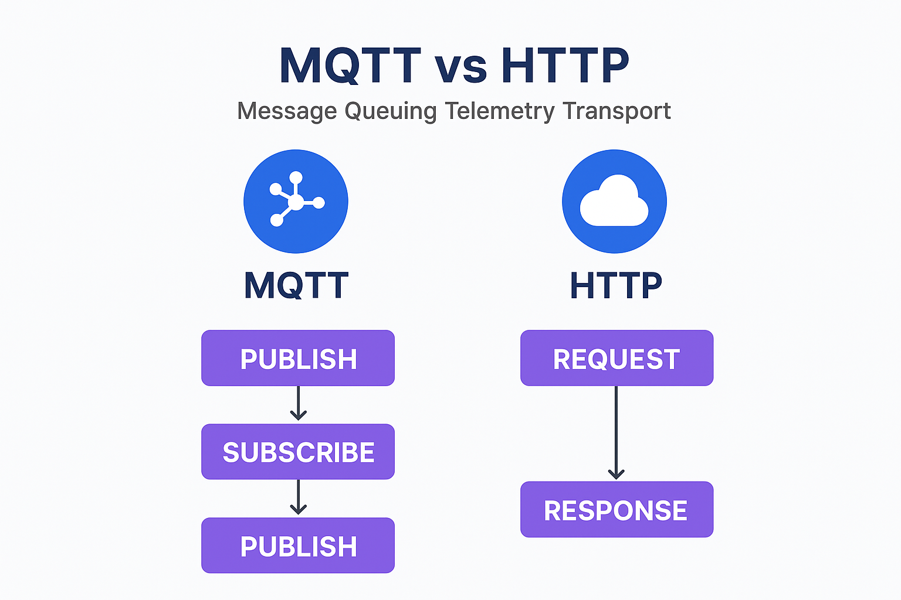

## 🧠 1. What is MQTT?

**MQTT** is a **lightweight messaging protocol** designed for:

* **Low-bandwidth** networks
* **High latency / unreliable** connections
* **Small memory footprint devices**

It is ideal for IoT applications where microcontrollers need to send and receive small packets of data reliably and efficiently.

Unlike HTTP (request/response), MQTT uses a **publish/subscribe** model via a **central broker**.

---

## 🔁 2. MQTT Communication Model

| Role        | Description                                                                             |
| ----------- | --------------------------------------------------------------------------------------- |
| **Client**  | Any device or app that connects to the broker (ESP32, web app, phone, etc.)             |
| **Broker**  | The server that routes messages between clients (e.g., Mosquitto, HiveMQ, AWS IoT Core) |
| **Topic**   | A hierarchical “channel” for messages (like a folder path, e.g. `home/livingroom/temp`) |
| **Message** | The payload (data) published to a topic (e.g. `{"temp": 23.5}`)                         |

---

### 🧩 Example Flow

| Step | Description                                                               |
| ---- | ------------------------------------------------------------------------- |
| 1️⃣  | ESP32 **connects** to MQTT broker (e.g. `broker.hivemq.com`)              |
| 2️⃣  | ESP32 **subscribes** to a topic like `home/led/control`                   |
| 3️⃣  | ESP32 **publishes** data to another topic like `home/led/status`          |
| 4️⃣  | Broker **distributes messages** to all clients subscribed to those topics |

---

## 🔒 3. MQTT vs HTTP (Main Differences)

| Feature                | **MQTT**                         | **HTTP**                          |
| ---------------------- | -------------------------------- | --------------------------------- |
| **Architecture**       | Publish/Subscribe (asynchronous) | Client/Server (synchronous)       |
| **Connection**         | Persistent TCP                   | Short-lived TCP                   |
| **Overhead**           | Very low (2 bytes header)        | High (HTTP headers)               |
| **Message Direction**  | Both directions                  | Usually one-way (client → server) |
| **Reliability Levels** | 3 QoS levels                     | None built-in                     |
| **Use Case**           | Real-time IoT messaging          | File transfers, APIs, websites    |

[]()



---

## ⚙️ 4. MQTT QoS (Quality of Service)

MQTT ensures message delivery via 3 reliability levels:

| QoS                   | Description                              | Use Case                |
| --------------------- | ---------------------------------------- | ----------------------- |
| **0 – At most once**  | Fire & forget. No ack.                   | Frequent sensor updates |
| **1 – At least once** | Guaranteed delivery (can be duplicated). | Control commands        |
| **2 – Exactly once**  | Guaranteed once only (most reliable).    | Billing, transactions   |

---

## 🌐 5. Underlying Transport

* MQTT runs **on top of TCP/IP**
* Secure version: **MQTTS** = MQTT + TLS (like HTTPS)
* Default ports:

  * `1883` for MQTT (non-secure)
  * `8883` for MQTTS (secure)

---

## 🧰 6. Typical IoT Use Case Example

```
ESP32 (Publisher) --> topic: sensors/room1/temp
Smartphone App (Subscriber) <-- receives temperature updates

Smartphone App (Publisher) --> topic: control/room1/led
ESP32 (Subscriber) <-- toggles LED on/off
```

This two-way communication is **asynchronous** — both sides can publish and subscribe freely.

---

## ⚡ 7. Why MQTT is Perfect for IoT

- ✅ Minimal bandwidth use
- ✅ Fast, reliable delivery
- ✅ Works with poor network conditions
- ✅ Ideal for small MCUs
- ✅ Easy integration with cloud IoT platforms (AWS IoT, Azure IoT, HiveMQ, etc.)

---

